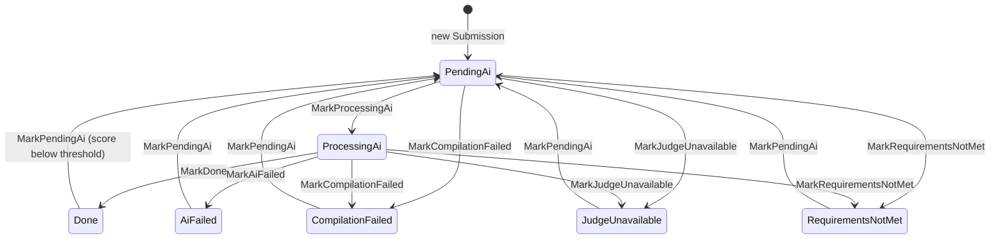

# Domain Model

> SmartGrader · Version 1.0 · Last updated 2026-08-26 · Status: as-built

| Version | Date | Change |
|---|---|---|
| 1.0 | 2026-08-26 | First edition. Replaces the entity content that was scattered across the superseded UX set, deleted in A7. |

**What this document answers:** what the things in this system *are* — their meaningful fields, their
enums, the states a submission moves through, and what is deliberately absent.

**What it does not answer:** who may touch them ([permissions.md](permissions.md)), or how a grade is
produced (`grading-rules.md`, phase A2).

Tables marked <!-- --> with a `gen:` block are compared against the code by
`server/Tests/SmartGrader.UnitTests/Docs/`. Editing the code without editing the table fails CI.
The *Meaning* columns are prose and are deliberately **not** asserted.

---

## The tables

Eleven `DbSet`s plus one implicit join table.

| Table | Holds | Owned by |
|---|---|---|
| `Users` | every login — teacher, student and admin alike | — |
| `Students` | a student as a person in a class; may or may not have a login | — |
| `SchoolClasses` | a class in an academic year | **nobody** — see Known Modeling Gaps |
| `Courses` | a named course | one teacher (`TeacherId`) |
| `Lessons` | one lesson on one date, inside a course | one teacher (`TeacherId`) |
| `LessonSchoolClass` *(implicit)* | which classes a lesson was assigned to | — |
| `Assignments` | one exercise inside a lesson | its lesson |
| `Submissions` | the **current** state of one student's work on one assignment | its student |
| `SubmissionAttempts` | the finished attempts that came before it | its submission |
| `LessonResults` | the final grade of one student for one lesson | its student |
| `PasswordResetTokens` | one outstanding reset link | its user |
| `Logs` | system events worth keeping | — |

**Uniqueness that carries meaning:**

| Index | Consequence |
|---|---|
| `Submissions (StudentId, AssignmentId)` unique | **One submission row per student per assignment, ever.** This is why attempt history needs its own table. |
| `SubmissionAttempts (SubmissionId, AttemptNumber)` unique | An attempt number is never reused. |
| `Users (Username)` unique | The login identifier. Immutable — there is no `SetUsername`. |
| `Users (Email)` unique | Normalised to lowercase on write, so `A@b.com` and `a@b.com` cannot both exist. |
| `Students (UserId)` unique | A login belongs to at most one student. |
| `SchoolClasses (Name, AcademicYear)` unique | The same class name may recur in a later year. |
| `Courses (TeacherId, Name)` unique | Two teachers may each have a course called the same thing. |
| `PasswordResetTokens (TokenHash)` unique | — |

---

## Entities

### `User` — every login

Teacher, student and admin are one table with a `Role`. **There is no `Teacher` entity** — a teacher is
a `User` with `Role = Teacher`, and that is the single most likely thing for a new feature to violate.

| Field | Meaning |
|---|---|
| `Username` | the login identifier. Normalised to lowercase, trimmed. **Immutable by design** — there is no `SetUsername`. |
| `PasswordHash` | never the password |
| `FullName` | |
| `Email` | **nullable on purpose.** Students have none. The obligation on a teacher is enforced by the Create/Update validators, not by the schema. |
| `Role` | see `UserRole` below |
| `FailedLoginAttempts`, `LockoutEndsAt` | the lockout state |

**Invariants**
- An expired lockout resets the counter on the next failed attempt, so five typos spread over a month
  do not accumulate into a lock.
- `RegisterFailedLogin` must not be called while the account is already locked — an attacker who kept
  guessing would extend the lock indefinitely and turn it into a permanent denial of someone else's
  account. `LoginHandler` returns before that point.

**Deliberate absence:** no self-registration path, and no `Register` endpoint. The creation chain is
Admin → Teachers → Students.

### `Student` — a person in a class

| Field | Meaning |
|---|---|
| `FullName` | |
| `ClassId` | **a single FK.** A student is in exactly one class, with no history. |
| `UserId` | nullable — `null` means she has no login yet |

**Deliberate absence:** no `TeacherId`. Which students a teacher may see is *derived*: her lessons →
the classes those lessons were assigned to → the students in those classes. That derivation lives in
exactly one place (`StudentScope`), and it is the reason a teacher with no lessons sees an empty list
rather than the whole school.

### `SchoolClass` — a class in a year

| Field | Meaning |
|---|---|
| `Name` | |
| `AcademicYear` | the Hebrew year as a number — `5786` = תשפ"ו |
| `IsArchived` | year rollover. **An archived class locks every submission of every student in it.** |

**Deliberate absence:** **no owner field at all.** See Known Modeling Gaps.

### `Course` — a named course

`Name` + `TeacherId`. A course belongs to one teacher; two teachers teaching C# produce two rows.

### `Lesson` — one lesson on one date

| Field | Meaning |
|---|---|
| `Subject` | **free text, not an entity.** Two lessons about loops are two unrelated strings. |
| `LessonDate` | stored as `DateTime`; entered and displayed as a Hebrew date |
| `TeacherId` | the ownership anchor for the lesson and everything under it |
| `CourseId` | |
| `Classes` | many-to-many — one lesson may be assigned to several classes |

`Lesson.TeacherId` is what `LessonAccess` checks, and assignments inherit their ownership from it.

### `Assignment` — one exercise

| Field | Meaning |
|---|---|
| `Title`, `Description` | both nullable in the schema |
| `MethodName` | the method the runner calls in `Method` / `MultiFileMethod` mode |
| `GradingMode` | how the code is executed — see the enum below |
| `IsBonus`, `BonusValue` | a bonus assignment is graded out of 100 like any other; `BonusValue` is what it adds to the **lesson** score |
| `TestsAllocation` | how many of the points go to the test cases. Default 100. **0 is legal** — a classes exercise has nothing to run and is graded on structure alone. |
| `RetryThreshold` | below this score the student may submit again. Default 85. |

**Four JSON-backed collections**, all `[NotMapped]` over a `…Json` column, all tolerant of corrupt data
(a deserialization failure yields an empty list rather than a 500):

| Property | Column | Holds |
|---|---|---|
| `Tests` | `TestsJson` | `TestCase` — input, expected, `IsSample`, `IsCore` |
| `ExpectedFiles` | `ExpectedFilesJson` | `ExpectedFile` — the file names a multi-file submission must contain |
| `ReferenceSolution` | `ReferenceSolutionJson` | `ReferenceSolutionFile` — **the full answer.** Never sent to a student on any path. |
| `StructuralRules` | `StructuralRulesJson` | `StructuralRule` — the requirements checked by Roslyn |

**Derived, not stored:**
- `ScoredRules` = the structural rules whose severity is `Scored`.

⚠️ **The assignment has no ceiling field, and that is the point.** `Assignment.TotalPoints` — 100 — is
the ceiling and the sum every rubric must add up to, bonus or not (`G-17`). A derived `MaxScore` that
returned `100 + BonusValue` lived here until Plan B's B2; it made a bonus of 20 worth 6.7 in a
three-assignment lesson, because the bonus was averaged in rather than added. `BonusValue` is now read
only by `LessonScoreCalculator`.

### `Submission` — the current state of one student's work

One row per `(StudentId, AssignmentId)`, forever. Resubmitting **mutates this row** and archives the
previous state into `SubmissionAttempts`.

| Field | Meaning |
|---|---|
| `SourceCode` / `SourceFiles` | single file, or several for a multi-file assignment |
| `Score` | `null` until graded — and `null` again after a resubmit |
| `Status` | see `SubmissionStatus` |
| `SubmittedAt` | **the first** submission. Never moves. |
| `LastSubmittedAt` | the current attempt. This is what rate limiting reads. |
| `AttemptNumber` | from 1. **Only the last attempt counts toward any grade.** |
| `GradedAt` | cleared on resubmit, so a screen cannot show a previous attempt's grading time |
| `HasUnusedExtraAttempt` | a one-shot teacher grant, consumed by the next submission |
| `ScoreOverridden…` | who overrode the score, when, and why |

**Derived:**
- `CanResubmit(retryThreshold)` — true on an unused grant, on any of the four failure statuses, or when
  `Done` with a score below the threshold. **This is not the whole answer** — see `SubmissionLock`.
- `IsRateLimited(utcNow)` — less than `MinResubmitInterval` since `LastSubmittedAt`.

**Invariants**
- `MarkPendingAi` is the only entry point to a new attempt, and it enforces the lock, `CanResubmit` and
  the rate limit **in the entity**, not only in the handler.
- A teacher's extra-attempt grant overrides the retry threshold. It **does not** override a lock.
- Resubmitting clears score, breakdown, feedback, test results, structural results and `GradedAt`
  together — none of them may survive into the next attempt.

**A gap worth naming:** `OverrideScore` sets `Status = Done` from **any** source status, with no guard.
Every other transition validates where it came from. This is the teacher's safety net and it is
reachable only by a teacher or admin, but it is the one unguarded edge in the machine.

### `SubmissionAttempt` — the attempts that came before

A separate table because the unique index on `Submissions` forbids a second row. Captured by
`Submission.MarkPendingAi` immediately before the reset.

The newest `FullDetailRetentionCount` attempts are kept whole; older ones are **collapsed** — code,
feedback, results and errors are dropped, leaving score, status and timestamps. Attempts are unlimited,
so without collapsing the archive grows without bound.

**Attempts never enter any average.**

### `LessonResult` — the final grade for one student in one lesson

| Field | Meaning |
|---|---|
| `FinalScore` | what the student gets |
| `ComputedScore` | what the system derived at the moment of finalisation — **kept even when overridden**, so it is possible to see afterwards what was departed from. `null` when no assignment was graded. |
| `IsComplete` | finalised. **This locks every submission of that student in that lesson.** |
| `FinalScoreOverridden…` | who, when, why |

**Invariants**
- A lesson is finalised **per (student, lesson)** — not per class.
- `CompleteWith` throws on an already-complete result. `Reopen` is the only way back, and it also
  releases that student's submissions in that lesson.
- Reopening keeps the score, as the starting point for the correction.
- Re-completing after a reopen clears any previous override, so a score that became computed again does
  not keep looking hand-entered.
- `GuardCanComplete` takes the ceiling as an argument rather than deriving it, and the only caller
  passes what `LessonScoreCalculator` computed: `100 + Σ BonusValue` (`G-21`). It was a flat 150 with a
  bonus and 100 without until Plan B's B2 — a number no bonus value ever produced.

### `Log` — system events

`Timestamp`, `ActionType`, `Message`, `Status`, `SystemSource`, and three optional context ids:
`UserId`, `LessonId`, `AssignmentId`.

Well-known values live as constants, not enums — `LogActionTypes`, `LogStatuses`, `LogSystemSources`.

Two action types are written **only on failure**, and that is deliberate in both cases:
`PasswordResetEmailFailed` (logging every request would build a list of registered addresses on the
admin's screen) and `TeacherDigestEmailFailed` (a quiet day sends no mail and writes no row, so without
this a broken SMTP looks exactly like a quiet day).

### `PasswordResetToken` — one outstanding reset link

Holds a **hash** of the token, never the token. The raw value exists only in the emailed link.

`Lifetime` is one hour. `UsedAt` is stamped both when a link is redeemed and when a newer link
supersedes it — the two mean the same thing to `IsUsable`, so there is one field, and it is never
overwritten once set.

---

## Enums

### `SubmissionStatus`

<!-- gen:enum SmartGrader.Domain.Entities.SubmissionStatus -->

| Member | Value | Meaning |
|---|---|---|
| `PendingAi` | 0 | Queued. No worker has picked it up. |
| `ProcessingAi` | 1 | A worker is running the pipeline. |
| `Done` | 2 | Graded — a score exists. |
| `AiFailed` | 3 | The model was unreachable or unusable. The student may submit again. |
| `CompilationFailed` | 4 | The code did not compile in the sandbox. |
| `JudgeUnavailable` | 5 | The runner was down. **Not the student's fault and she has nothing to fix.** |
| `RequirementsNotMet` | 6 | A blocking structural rule failed. **No grade at all** — not a low grade. Judge0 is never called on this path. |

<!-- /gen -->

**Seven, not four.** The superseded `master-spec.md` listed four; that gap is why this table is machine-checked.

### `UserRole`

<!-- gen:enum SmartGrader.Domain.Entities.UserRole -->

| Member | Value | Meaning |
|---|---|---|
| `Teacher` | 0 | Authors content, grades, manages her own students |
| `Student` | 1 | Submits and reads her own results |
| `Admin` | 2 | Manages teachers, reads the log, ends the school year |

<!-- /gen -->

### `GradingMode`

<!-- gen:enum SmartGrader.Domain.Entities.GradingMode -->

| Member | Value | Meaning |
|---|---|---|
| `FullProgram` | 0 | The student's own `Main` runs unwrapped; the test input is the whole stdin |
| `Method` | 1 | The code is wrapped and `MethodName` is called; input is space-separated |
| `MultiFileMethod` | 2 | A multi-file project entered through a method named in `ExpectedFiles`; input is a JSON array |

<!-- /gen -->

### `RuleKind`

Serialized **as a string**, because rules live inside `Assignment.StructuralRulesJson`. Storing them as
numbers would make every insertion into the middle silently change the meaning of existing assignments.

<!-- gen:enum SmartGrader.Domain.Entities.RuleKind -->

| Member | Value | Meaning |
|---|---|---|
| `MustUse` | 0 | The construct must appear at least once |
| `MustNotUse` | 1 | It must not appear at all |
| `AtLeast` | 2 | At least `Threshold` occurrences |
| `AtMost` | 3 | At most `Threshold` occurrences |

<!-- /gen -->

### `RuleSeverity`

<!-- gen:enum SmartGrader.Domain.Entities.RuleSeverity -->

| Member | Value | Meaning |
|---|---|---|
| `Blocking` | 0 | 🔴 **Rejection, not a low grade.** No score is produced; the submission returns to the student. Carries no points — it is a gate. |
| `Scored` | 1 | 🟡 Failing loses its points **in full**. A requirement is a condition, not a measurement — four `if`s where at most three were allowed loses everything, not a quarter. |
| `Advisory` | 2 | ⚪ A note in the feedback. No effect on the score. |

<!-- /gen -->

### `CodeConstruct`

The catalog of structures an assignment may require. **Ordered by teaching order, not alphabetically** —
the list is shown to the teacher exactly as it is written. Numeric values are not part of the contract
and may be inserted in the middle; the JSON is written as strings.

Adding a construct is **one value here plus one `case` in `RoslynCodeAnalysisService`**.

<!-- gen:enum SmartGrader.Domain.Entities.CodeConstruct -->

| Member | Value | Meaning |
|---|---|---|
| `If` | 0 | conditionals |
| `Switch` | 1 | |
| `Ternary` | 2 | |
| `For` | 10 | loops |
| `While` | 11 | |
| `DoWhile` | 12 | |
| `Foreach` | 13 | |
| `AnyLoop` | 14 | a loop of any kind — the sum of all four |
| `Method` | 20 | methods |
| `Recursion` | 21 | a method whose body calls itself |
| `Array` | 30 | collections |
| `Matrix` | 31 | two-dimensional and above — **must not collapse into `Array`** |
| `List` | 32 | |
| `Dictionary` | 33 | |
| `BoolVariable` | 40 | variable kinds |
| `StringVariable` | 41 | |
| `CharVariable` | 42 | |
| `LocalVariable` | 43 | |
| `Constant` | 44 | |
| `Class` | 50 | object orientation — this group exists because a classes exercise has no input and no output at all, and without it cannot be expressed |
| `Property` | 51 | |
| `Constructor` | 52 | |
| `Field` | 53 | |
| `Inheritance` | 54 | |
| `Interface` | 55 | |
| `TryCatch` | 60 | advanced |
| `Linq` | 61 | |
| `Break` | 70 | flow control |
| `Continue` | 71 | |
| `Goto` | 72 | |
| `NestedLoopDepth` | 80 | maximum loop nesting depth — efficiency is not a separate scoring component, it is a scored requirement using this construct |

<!-- /gen -->

**Thirty-one.** A planning document said 33. That is why this table is machine-checked.

---

## The submission state machine

**Legal source states, per transition:**

| Transition | Legal from | Guard |
|---|---|---|
| `MarkProcessingAi` | `PendingAi` | — |
| `MarkDone` | `ProcessingAi` | — |
| `MarkAiFailed` | `ProcessingAi` | — |
| `MarkCompilationFailed` | `PendingAi`, `ProcessingAi` | — |
| `MarkJudgeUnavailable` | `PendingAi`, `ProcessingAi` | — |
| `MarkRequirementsNotMet` | `PendingAi`, `ProcessingAi` | — |
| `MarkPendingAi` | the five above, plus `Done` under threshold | **not locked**, `CanResubmit`, not rate-limited |
| `OverrideScore` → `Done` | **any state** | ⚠️ **no source-state guard** |

Both failure statuses that are decided **before** the model is called — `CompilationFailed` and
`RequirementsNotMet` — are persisted first and given feedback afterwards via `SetFeedback`, so an
OpenAI outage cannot erase a fact already established.

---

## Named constants

| Constant | Value | Where |
|---|---|---|
| `Submission.MinResubmitInterval` | 1 minute | the gap between two attempts; also absorbs a double-click |
| `Assignment.DefaultRetryThreshold` | 85 | below this the student may resubmit |
| `Assignment.TotalPoints` | 100 | what every rubric must sum to, and every assignment's ceiling |
| `User.MaxFailedLoginAttempts` | 5 | consecutive failures that lock an account |
| `User.LockoutDuration` | 15 minutes | |
| `PasswordResetToken.Lifetime` | 1 hour | long enough to open an email, short enough to be useless to an attacker |
| `SubmissionAttempt.FullDetailRetentionCount` | 10 | attempts kept in full before collapsing |

**One number is not a named constant and should be:** the `0.05` tolerance in
`LessonScoreCalculator.Matches` is an inline literal. It exists because `Calculate` rounds to one
decimal, so an exact `==` on a `double` would flag the system's own suggestion as a departure requiring
a written reason.

**Three columns carry `HasSentinel(-1)`** — `TestsAllocation`, `RetryThreshold` and `AttemptNumber`.
Without it EF omits the column from the `INSERT` when the value equals the CLR default, and the database
default silently wins over a deliberate `0` or `1`.

---

## Known Modeling Gaps

Accepted structural decisions, each with its rationale **and its consequence** — so the choice stays
deliberate instead of being rediscovered as a bug in six months.

**Academic year exists only on `SchoolClass`.** Courses and lessons carry no year, so they accumulate
indefinitely. *Accepted: this is a single-year system.*

**A course belongs to one teacher** — `Course.TeacherId`, unique on `(TeacherId, Name)`. Two teachers
teaching C# produce two separate rows. *Accepted: a course is personal.*

**No model for a student moving between years** — `Student.ClassId` is a single FK with no history.
*Accepted: same rationale.*

**Classes are a shared institutional resource.** `SchoolClass` has **no owner field at all** — no
`TeacherId` — which is why `SchoolClassRepository.GetAllAsync(includeArchived)` has no teacher parameter
to filter on. Every teacher sees, creates, edits and deletes every class. *Accepted: a class is school
structure, not a teacher's private object, and the teaching staff is small enough to rely on mutual
trust.*
**Consequence, stated plainly:** this is the only resource outside the ownership model. A teacher can
rename another teacher's class, or delete it while it is still empty, and nothing records who did it.
If the staff grows, or an accidental rename causes real confusion, the fix is either an owner column on
`SchoolClass` or restricting writes to an admin — both cheap, neither done now.

**A lesson's topic is free text, not an entity.** `Lesson` carries both a `CourseId` and a free-string
`Subject`, so two lessons about loops are two unrelated strings and assignments hang off a calendar date
rather than a topic. *Recorded as the root cause of the "lessons and assignments feel disorganised"
impression; worth revisiting if the system ever spans more than one year.*

**There is no `Teacher` entity.** A teacher is a `User` with `Role = Teacher`. Every `TeacherId` in the
schema is a user id.

**There is no `Notification` entity, and one must not be added.** Every signal is computed on demand
from `Submission` rows inside a date window. Adding a table would create a second, staler answer to
"what happened today".
