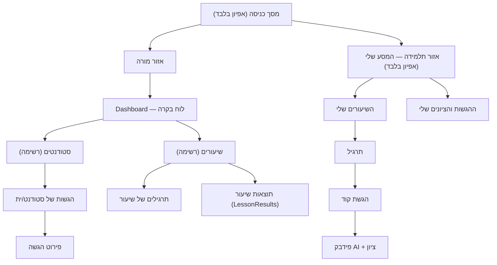

# SmartGrader — אפיון-על (Master Spec)

> גרסה 1 · 14.07.2026 · מסמך-העל של צד הלקוח. מסמכי הפיצ'רים (jtbd/journey/flow) עונים על
> "איך מסך X עובד"; מסמך זה עונה על "מה הופך את כל המסכים למערכת אחת".
> מקור ההחלטות: [redesign-plan.md](redesign-plan.md).

---

## 1. מטרת המוצר ופרסונות

SmartGrader היא מערכת בדיקת תרגילי קוד: מורה מגדירה שיעורים ותרגילים עם מקרי בדיקה,
תלמידות/ים מגישים קוד, ומנוע AI בודק ומציין. המוצר קיים כדי שהמורה תסגור שיעור שלם —
כל התרגילים בדוקים ולכל תלמיד/ה ציון סופי — במינימום התערבות ידנית.
שתי הפרסונות (מורה, תלמיד/ה) מוגדרות ב-[personas.md](personas.md) — לא משוכפלות כאן.

## 2. החזון העיצובי — "מינימליזם חם"

עקרונות נעולים (מ-[redesign-plan.md](redesign-plan.md)):

- **הפלטה הקיימת נשארת הזהות**: רקע בז' `#f3efe7`, משטחים `#fbfaf8`, accent טאופה `#8a6a54`,
  פונט Rubik. "נקי" = היררכיה, ריווח וצמצום תוכן — לא צביעה מחדש.
- **3 רמות גובה בלבד**: רקע שטוח ← כרטיס (`--shadow-sm`) ← שכבת-על: דיאלוג/תפריט (`--shadow-md`).
- **גריד 8pt**: כל ריווח נגזר מ-`--space-1..6` (0.25/0.5/0.75/1/1.5rem).
- **סקאלה טיפוגרפית אחת**: display (`--text-xl`) / title (`--text-lg`) / body (`--text-base`) /
  caption (`--text-sm`). אין גדלים אד-הוק.
- הטוקנים מוגדרים פעם אחת ב-`client/src/styles.css` ונגזרים ממשתני `--app-*` קיימים
  (כלל המיפוי ב-[client/spec.md](../../client/spec.md)).

## 3. מפת מסכים (Sitemap)

### אזור מורה — שרשראות breadcrumb

- לוח בקרה ← סטודנטים ← הגשות של {שם} ← פירוט הגשה
- לוח בקרה ← שיעורים ← תרגילים של {שיעור}
- לוח בקרה ← שיעורים ← תוצאות שיעור {שיעור}

קישורי "חזרה ל..." יושבים במשבצת ה-breadcrumb של כותרת העמוד — לא בתוך סרגל הכלים.

### אזור תלמידה — "המסע שלי" (אפיון + עיצוב בלבד; ללא מימוש auth/ראוטים במשימה זו)

**נקודת כניסה**: אחרי התחברות בתפקיד תלמיד/ה.

1. **השיעורים שלי** (תבנית רשימה, מצומצמת): שם שיעור, נושא, תאריך, סטטוס אישי
   (בתהליך / הושלם + ציון סופי). ללא פעולות ניהול — צפייה בלבד.
2. בחירת שיעור ← **התרגילים שלי בשיעור**: לכל תרגיל סטטוס הגשה אישי
   (לא הוגש / ממתין לבדיקה / נבדק + ציון). CTA ראשי: "הגשת קוד".
3. **הגשת קוד** (תבנית טופס): שדה קוד (LTR, מונוספייס), כפתור "הגשה".
   לאחר שליחה — טוסט "הקוד נשלח לבדיקה" ומעבר לפירוט ההגשה.
4. **פידבק AI** (תבנית פירוט): אזור סטטוס מאוחד — בבדיקה (ענבר + רענון אוטומטי) /
   נבדק (מרווה + ציון + הערות AI) / שגיאת קומפילציה (טרקוטה + פלט הקומפיילר) — עם CTA
   "עריכה והגשה מחדש" במצבי כישלון.
5. **הציונים שלי**: רשימת הגשות אישית + ציון סופי לכל שיעור שהושלם (LessonResult).

**נקודות יציאה**: חזרה לרשימת השיעורים; התנתקות.

### מסך כניסה (אפיון + עיצוב בלבד)

**נקודת כניסה**: כתובת האפליקציה, משתמש לא מחובר.

1. עמוד מרכזי יחיד על רקע `--app-bg`: כרטיס (`sg-card`) ברוחב ~400px ממורכז,
   לוגו/שם המוצר למעלה, שדות "אימייל" ו"סיסמה" (עברית, RTL; שדה הסיסמה עם הצגה/הסתרה),
   כפתור ראשי "כניסה" ברוחב מלא.
2. שגיאת התחברות — הודעה inline מעל הכפתור בסמנטיקת `--status-error` + אייקון, לא טוסט.
3. הצלחה — ניתוב לפי תפקיד: מורה ← לוח בקרה; תלמיד/ה ← "המסע שלי".

**נקודות יציאה**: כניסה מוצלחת. (שחזור סיסמה — מחוץ לתכולה.)

## 4. שלוש תבניות-האם

כל מסך במערכת מוכרז כמופע של אחת מהתבניות. אין מסך "חופשי".

### 4.1 תבנית רשימה

האנטומיה המלאה מוגדרת ב-skill
[client-list-table-pattern](../../.github/skills/client-list-table-pattern/SKILL.md):
כותרת עמוד (כותרת + תת-כותרת + פעולה ראשית "+ חדש" בתחילת השורה + breadcrumb) ←
שורת חיפוש/סינון ← סרגל בחירה (מוצג רק כשיש בחירה; "נבחרו N · מחיקת נבחרים · ביטול בחירה" —
**עיצוב בלבד**) ← טבלה ([☑] | עמודות מידע | [👁 צפייה] | [⋯ פעולות]) ← paginator תקין ב-RTL.

מופעים: סטודנטים, שיעורים, תרגילים, הגשות, תוצאות שיעור, (עתידי: השיעורים שלי).

### 4.2 תבנית טופס

- שדות קומפקטיים (~38px), מסגרת דקה `--app-border`, focus ring רך.
- ולידציה inline: הודעת `p-error` מתחת לשדה, מוצגת רק אחרי `touched`
  (הדפוס של `methodName` ב-assignment-form — ראו
  [client-flow-fix-implementation-pattern](../../.github/skills/client-flow-fix-implementation-pattern/SKILL.md)).
- שדות חובה מסומנים ב-`*` בתווית; placeholders בעברית בלבד ("לדוגמה: נועה כהן").
- פעולות בתחתית: "ביטול" (outlined) ואז "שמירה/יצירה" (ראשי) — מיושרות לקצה השורה.
- יציאה עם שינויים שלא נשמרו ← דיאלוג "שינויים שלא נשמרו".

מופעים: טופס סטודנט, טופס שיעור, טופס תרגיל, טופס הגשה, (עתידי: הגשת קוד לתלמיד/ה, כניסה).

### 4.3 תבנית פירוט

- כותרת עמוד + פעולות משנה (חזרה, עריכה).
- **אזור סטטוס מאוחד**: משבצת אחת שבה מוצגים סטטוס, שגיאת קומפילציה, שגיאת AI והערות —
  באותו מקום, באותה שפה ויזואלית (צבע סמנטי + אייקון), במקום קופסאות מפוזרות.
- גריד key-value לשדות מידע (תווית caption + ערך body).
- בלוק קוד: `sg-code-box` — LTR, מונוספייס, רקע כהה יחיד.

מופעים: פירוט הגשה, (עתידי: פידבק AI לתלמיד/ה).

## 5. דפוסים משותפים

### מצבי ריק / טעינה / שגיאה

- **ריק**: אייקון `pi-inbox` + משפט קצר + CTA בעברית ("אין תרגילים להצגה." + "תרגיל חדש").
- **טעינה**: `[loading]` בטבלאות; skeleton בכרטיסי KPI; לעולם לא מסך לבן.
- **שגיאת HTTP**: נתפסת גלובלית ב-`ApiErrorInterceptor` ← טוסט שגיאה; הרכיב לא מציג
  `console.error`/`alert`.

### טוסטים ואישורי מחיקה

- טוסטים דרך `MessageService` בלבד; עברית, ניסוח ניטרלי-מגדרית
  (summary: "בוצע" / "שגיאה"; detail: "השיעור נמחק בהצלחה").
- מחיקה דרך `ConfirmationService` בלבד, בתבנית:
  `האם למחוק את "{שם}"? לא ניתן לשחזר פעולה זו.` · header: "אישור מחיקה" ·
  accept: "מחיקה" · reject: "ביטול".

### פורמט תאריך

`dd.MM.yy HH:mm` (למשל `13.07.26 10:33`) — locale עברי, ללא AM/PM, ללא אייקון לוח שנה בתא.
מוגדר פעם אחת (locale ב-`app.config.ts`) ומשמש בכל pipe תאריך.

### סמנטיקת סטטוסים

| טוקן               | גוון         | שימוש                | אייקון מלווה                                  |
| ------------------ | ------------ | -------------------- | --------------------------------------------- |
| `--status-success` | מרווה        | נבדק / הושלם         | `pi-check-circle`                             |
| `--status-warn`    | ענבר         | ממתין / בבדיקה       | `pi-clock` / `pi-spinner`                     |
| `--status-error`   | טרקוטה עמומה | שגיאת קומפילציה / AI | `pi-times-circle` / `pi-exclamation-triangle` |
| `--status-info`    | טאופה        | ניטרלי / בתהליך      | `pi-info-circle`                              |

לעולם לא צבע לבדו — תמיד אייקון + צבע (נגישות לעיוורי צבעים).

## 6. נגישות

הצ'קליסט המחייב: [accessibility-checklist.md](accessibility-checklist.md). קווים אדומים:

- ניווט מקלדת מלא (כולל תפריט ⋯, checkboxes, דיאלוגים — Escape סוגר).
- `aria-label` בעברית לכל כפתור-אייקון ("פעולות נוספות", "צפייה בהגשות: {שם}").
- ניגודיות 4.5:1 לטקסט רגיל; סטטוס = צבע + אייקון.
- RTL תקין בכל רוחב (360/768/1280px), כולל כיווני חצים ב-paginator.
- `prefers-reduced-motion` מכובד גלובלית.

## 7. פיצ'רים עתידיים (מאופיינים — לא ממומשים במשימה זו)

- **התראות (פעמון)**: הפעמון בטופבר יציג הגשות שסיימו בדיקת AI (מונה אמיתי + רשימה נפתחת).
  עד אז — פעמון ללא מונה; המונה המזויף "3" הוסר.
- **התחברות ותפקידים** (מורה/תלמיד־ה): ה-flow בסעיף 3 בלבד; ללא guards, ללא ראוטים, ללא לוגיקה.
- **אזור תלמידה פונקציונלי**: "המסע שלי" מאופיין בסעיף 3; המימוש — משימה נפרדת.
- **מחיקה מרובה בפועל**: ה-UI (checkbox + "מחיקת נבחרים") קיים כעיצוב; לחיצה מציגה טוסט info
  "מחיקה מרובה תהיה זמינה בקרוב". endpoint מרוכז בשרת — עתידי.
- **ממוצע ציונים לתלמיד/ה ולשיעור בעמודות הרשימה**: מחייב שדה חדש ב-DTO בצד השרת — מחוץ
  לתכולת צד-הלקוח הנוכחית; מאופיין כעמודת "ממוצע" בתבנית הרשימה ויתווסף כשהשרת יחשוף נתון.

---

## קישורים

- [redesign-plan.md](redesign-plan.md) — תוכנית העבודה ומקור ההחלטות.
- מסמכי פיצ'ר: [students](students-flow.md) · [lessons](lessons-flow.md) ·
  [assignments](assignments-flow.md) · [submissions](submissions-flow.md) ·
  [lessonresults](lessonresults-flow.md) (+ jtbd/journey לכל אחד).
- [client/spec.md](../../client/spec.md) — טוקנים, אילוצים וצ'קליסט אימות.
